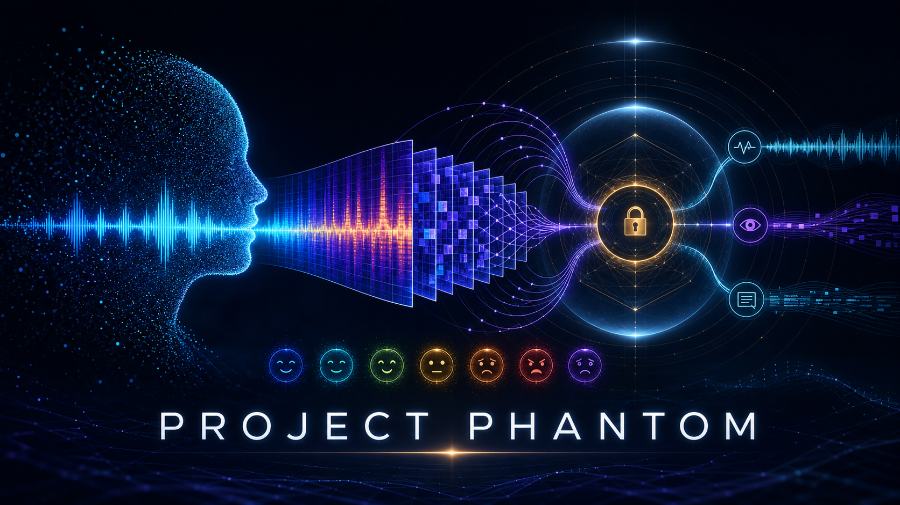
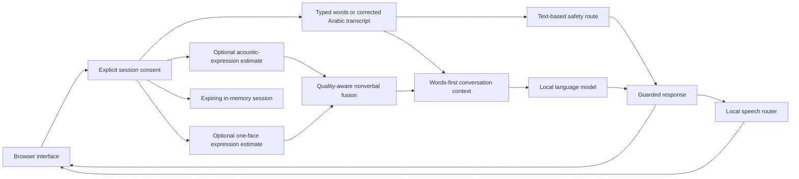

<p align="center">
  
</p>

<h1 align="center">project PHANTOM</h1>

<p align="center">
  <strong>Privacy-Preserving Human Affect and Natural-Tone Observation Module</strong>
</p>

PHANTOM is a local, consent-first research prototype that brings typed conversation, Arabic speech, and optional visual signals into one browser application. It explores how an assistant can respond to what a person says while treating voice and facial-expression estimates as uncertain context, not as facts about that person.

You can start with typed chat, add microphone or camera access when you choose, review a speech transcript before sending it, and listen to a spoken reply. The application runs on your own machine through Docker. It does not require a robot, a cloud account, or an API key for the default configuration.

> **Research use only.** PHANTOM is not a therapist, doctor, medical device, lie detector, identity system, or emergency service. Its outputs cannot establish a person's true emotions, age, intentions, or mental-health state. Do not use this software for diagnosis, treatment, surveillance, employment, grading, insurance, access decisions, policing, or emergencies.

## Contents

- [About the project](#about-the-project)
- [Main features](#main-features)
- [Demo mode and real mode](#demo-mode-and-real-mode)
- [Requirements](#requirements)
- [Install the platform tools](#install-the-platform-tools)
- [Windows tutorial](#windows-tutorial)
- [Linux tutorial](#linux-tutorial)
- [Using the browser application](#using-the-browser-application)
- [Configuration and model storage](#configuration-and-model-storage)
- [Troubleshooting](#troubleshooting)
- [How the system works](#how-the-system-works)
- [Models and their limitations](#models-and-their-limitations)
- [Privacy, consent, and safety](#privacy-consent-and-safety)
- [API reference](#api-reference)
- [Development and testing](#development-and-testing)
- [Verification status](#verification-status)
- [Repository structure](#repository-structure)
- [Sharing and publishing](#sharing-and-publishing)
- [Contributing](#contributing)
- [License and citation](#license-and-citation)

## About the project

PHANTOM is designed for experimentation in multimodal interaction, Arabic speech interfaces, and responsible conversational systems. The user's current words remain the main source of meaning. If a voice or facial-expression estimate conflicts with an explicit statement, the statement takes priority.

The application separates speech recognition, acoustic analysis, facial-expression analysis, language generation, speech output, and session management into replaceable components. This makes it possible to study individual parts of the pipeline without treating the entire system as a validated assessment tool.

The current release is software-only and CPU-oriented. It uses a browser for camera and microphone capture, a local FastAPI service for processing, and Docker Compose to package the runtime. Windows and Linux use the same Linux container images.

## Main features

- **Typed conversation:** use the assistant without granting microphone or camera access.
- **Arabic speech transcription:** record a short voice message and review the transcript before submitting it.
- **Optional voice analysis:** inspect limited acoustic-expression estimates with confidence and quality information.
- **Optional camera analysis:** process individual snapshots, with abstention when no suitable single face is available.
- **Separate age consent:** enable approximate age analysis only when both camera and age permissions are selected. Age is not used as affect evidence.
- **Words-first responses:** prioritize typed text, corrected transcripts, and explicit self-reports over sensor estimates.
- **Local speech output:** use Piper for Arabic or mixed-script replies and eSpeak NG for English-only replies inside the containers.
- **Explicit session controls:** choose permissions before a session and stop and delete the session when finished.
- **Visible model status:** distinguish real backends, simulated demo behavior, and unavailable components.
- **Portable packaging:** install the application runtime through Docker rather than reproducing a developer's Python environment.

## Demo mode and real mode

Both modes use the same browser interface and consent controls. They serve different purposes.

| Mode | What it runs | When to use it |
| --- | --- | --- |
| **Demo** | Deterministic, clearly labeled simulated behavior. No pretrained perception or language model is invoked. Speech output is text-only. | Check installation, explore the interface, and test the session workflow without downloading ML models. |
| **Real** | The configured pretrained speech, vision, language, and speech-output backends on CPU. | Try the actual model pipeline after confirming sufficient resources and successful backend readiness checks. |

The default `docker compose` configuration starts **demo mode**. Real mode requires the additional `compose.realtime.yaml` file shown in both tutorials.

A failed real perception backend is not silently replaced with simulated inference. Model failures remain visible. Language generation has a separate bounded, non-diagnostic fallback when the local language provider fails or produces certain unsuitable responses.

**Start with demo mode, then move to real mode.** A working demo confirms the interface and local service workflow. It does not prove that the real models load, perform accurately, or behave safely.

## Requirements

### Software

- Git, to clone the repository.
- Docker Desktop with the WSL 2 backend on Windows 11, or Docker Engine with the Compose plugin on Linux.
- Docker Compose v2 or newer. Commands use `docker compose`, with a space.
- A current browser with microphone and camera support, such as Chrome, Edge, or Firefox.
- Internet access for the first image build and the initial real-model downloads.

**You do not need to install Python, Node.js, CUDA, or project requirements on the host when following the Docker tutorials.** The Dockerfile installs Python 3.11 and the dependencies needed by the selected image.

### Hardware and storage

The packaged target is **`linux/amd64`**, for Intel and AMD 64-bit machines. Docker Desktop runs that Linux image on Windows. ARM and aarch64 systems, GPU acceleration, and emulated execution are not validated by this setup.

- The demo service has a 1 GiB memory limit and a two-CPU limit. Docker and the operating system require additional resources.
- For real mode, plan for at least **8 GiB of RAM available to Docker**, preferably 12 to 16 GiB.
- Allow approximately **15 to 20 GiB of free disk space** for the real image, build cache, and downloaded model weights.
- A microphone and camera are optional. Neither is required for typed chat.

These figures are planning estimates, not measured requirements for every machine. On Windows, the RAM available to Docker or WSL 2 may be lower than the machine's installed RAM. A computer with 16 GiB or more is generally a more practical starting point for the full stack. CPU responses can take tens of seconds, especially during the first request.

### Files and configuration

No `.env` file or API key is required for the default Docker profiles. Keep `Dockerfile`, `docker-compose.yml`, `compose.realtime.yaml`, and the source directories together in the cloned repository.

The application is intended for local use at **http://127.0.0.1:8000/**. It has no authentication or deployment-grade multi-user isolation. Do not expose the port to your network or the public internet.

## Install the platform tools

Complete the setup for your operating system before starting its tutorial. If Git and Docker already work, skip installation and continue to the cloning step.

### Windows 11 prerequisites

1. Install [Git for Windows](https://git-scm.com/install/windows). Allow the installer to make Git available from the command line.
2. Install [Docker Desktop for Windows](https://docs.docker.com/desktop/setup/install/windows-install/) using the instructions for your supported Windows version.
3. Select the **WSL 2 backend** and use **Linux containers**, not Windows containers.
4. Start Docker Desktop from the Start menu and wait for its engine to finish starting.
5. Open a new PowerShell window after installation so it can find the new commands.

If WSL 2 is not installed, follow [Microsoft's WSL installation guide](https://learn.microsoft.com/en-us/windows/wsl/install). The usual installation command runs from an administrator PowerShell window:

```powershell
wsl --install
```

Restart Windows if prompted. If WSL is already installed but needs an update, use:

```powershell
wsl --update
```

Hardware virtualization must be enabled for the WSL 2 backend. Docker's Windows installation guide explains the current operating-system and virtualization requirements. Review Docker Desktop's license terms if you are installing it for an organization.

Check the tools in a normal PowerShell window:

```powershell
git --version
docker version
docker compose version
```

`docker version` should report both a client and a server. A client-only result or daemon connection error means Docker Desktop is not ready.

### Linux prerequisites

Install Git, Docker Engine, and the Compose plugin using the instructions for your distribution:

- [Ubuntu](https://docs.docker.com/engine/install/ubuntu/)
- [Debian](https://docs.docker.com/engine/install/debian/)
- [Fedora](https://docs.docker.com/engine/install/fedora/)
- [Other supported distributions](https://docs.docker.com/engine/install/)

The following example follows Docker's official repository method for a **fresh, supported Ubuntu installation**. Do not use Ubuntu repository commands on Debian, Fedora, or another distribution. If Docker or containerd is already installed, check the official guide for package conflicts before changing that installation.

Install Git and the packages used to configure the Docker repository:

```bash
sudo apt update
sudo apt install -y git ca-certificates curl
sudo install -m 0755 -d /etc/apt/keyrings
sudo curl -fsSL https://download.docker.com/linux/ubuntu/gpg -o /etc/apt/keyrings/docker.asc
sudo chmod a+r /etc/apt/keyrings/docker.asc
```

Add Docker's official package source. Run this only if you have not already configured that source:

```bash
sudo tee /etc/apt/sources.list.d/docker.sources > /dev/null <<EOF
Types: deb
URIs: https://download.docker.com/linux/ubuntu
Suites: $(. /etc/os-release && echo "${UBUNTU_CODENAME:-$VERSION_CODENAME}")
Components: stable
Architectures: $(dpkg --print-architecture)
Signed-By: /etc/apt/keyrings/docker.asc
EOF
```

Install and start Docker:

```bash
sudo apt update
sudo apt install -y docker-ce docker-ce-cli containerd.io docker-buildx-plugin docker-compose-plugin
sudo systemctl start docker
```

Verify the tools:

```bash
git --version
sudo docker version
sudo docker compose version
sudo docker run --rm hello-world
```

The Linux tutorial below uses `sudo docker` for a conventional Docker Engine installation. If your account already has Docker access, or you use a correctly configured rootless installation, omit `sudo`.

**Security note:** membership in the `docker` group grants root-equivalent access to the host. It is not required to follow the `sudo` commands below. Do not make the Docker socket world-writable to work around a permission error.

## Windows tutorial

Use **PowerShell** for this walkthrough. Complete the Windows prerequisites above first.

### 1. Clone the repository and enter its directory

Open PowerShell in the folder where you want to keep the project. Replace `YOUR_GITHUB_USERNAME` with the GitHub account that owns the published repository. If its name is different, update the repository name in the URL as well. The explicit destination keeps the local directory name consistent.

```powershell
git clone https://github.com/YOUR_GITHUB_USERNAME/project-phantom.git project-phantom
cd project-phantom
```

If you already cloned the repository, enter that existing folder instead of cloning it again. All remaining project commands run from the folder containing `Dockerfile` and `docker-compose.yml`.

### 2. Confirm Docker Desktop is running

```powershell
docker version
docker compose version
```

Keep Docker Desktop open. If the daemon is unavailable, wait for the engine to start before continuing. Ensure Docker is using Linux containers.

### 3. Build the demo image and install its dependencies

```powershell
docker compose build
```

This command downloads the Python base image, packages PHANTOM, and installs the demo application's runtime dependencies inside the image. You do **not** need to run `pip install -r requirements.txt`, create a virtual environment, or install speech drivers on Windows.

### 4. Start the demo application

```powershell
docker compose up -d
docker compose ps
```

The service is named `phantom`. Wait for it to become healthy, then open the application:

```powershell
Start-Process "http://127.0.0.1:8000/"
```

You can also enter that address in your browser manually. The page should clearly identify **demo mode**.

### 5. Check that the demo works

In the browser:

1. Enable **Message analysis** and leave the microphone and camera off.
2. Select **Start a private session**.
3. Type a short message and select **Send message**.
4. Confirm that the reply is labeled as a demo response.
5. Select **Stop & delete session** when finished.

Demo speech is text-only. Missing spoken audio in this mode is expected, not an installation failure.

Run the automated application check:

```powershell
docker compose exec phantom python scripts/container_smoke.py --mode demo
```

A successful result includes `"status": "passed"` and `"mode": "demo"`. The check verifies browser assets, session consent, a text turn, and session deletion without using personal recordings.

To inspect logs:

```powershell
docker compose logs -f phantom
```

Press `Ctrl+C` to leave the log viewer. Because the container was started with `-d`, this does not stop the application.

### 6. Build and start the full real-mode application

If you only want to explore the interface, you can stop after the demo. To use the real models, first stop it:

```powershell
docker compose down
```

Build the real image, then start it using both Compose files:

```powershell
docker compose -f docker-compose.yml -f compose.realtime.yaml build
docker compose -f docker-compose.yml -f compose.realtime.yaml up -d
docker compose -f docker-compose.yml -f compose.realtime.yaml logs -f phantom
```

The build installs the full CPU runtime, including PyTorch, TensorFlow, DeepFace, faster-whisper, Transformers, Piper, and eSpeak NG. The first startup then downloads the required model weights and verifies the pinned Arabic voice files.

Allow time for both stages. The real profile has a 30-minute health-check startup allowance, but that is not a promise that every download will finish within 30 minutes. A slow network or insufficient memory can still prevent startup.

Once startup completes, leave the log viewer with `Ctrl+C`. Use the same address, **http://127.0.0.1:8000/**, and confirm that the interface now shows **real mode**.

### 7. Verify real backend readiness

```powershell
docker compose -f docker-compose.yml -f compose.realtime.yaml ps
Invoke-RestMethod -Uri "http://127.0.0.1:8000/api/health" | ConvertTo-Json -Depth 6
docker compose -f docker-compose.yml -f compose.realtime.yaml exec phantom python scripts/container_smoke.py --mode real
```

The health response should show `"mode": "real"`, `"status": "ready"`, and `"readiness": "ready"` for all six components: `speech_to_text`, `voice_emotion`, `facial_emotion`, `age`, `llm`, and `tts`.

The real smoke check also requires a text response and a generated WAV response. A container marked `healthy` proves that HTTP is reachable. It does not, by itself, prove that every model is ready.

If a component reports `unavailable`, use the troubleshooting section before treating the full application as working.

### 8. Try the complete browser workflow

1. Start a text-only session and send a message.
2. Stop and delete that session before selecting a different set of permissions.
3. Enable **Message analysis** and **Microphone** for speech. Enable **Camera** only if you want visual input.
4. Select **Start a private session**, then grant the corresponding browser permissions when requested.
5. Hold **Hold to talk**, speak a short Arabic sentence, and release the control.
6. Wait for transcription, correct any mistakes in the message field, and select **Send message**.
7. Select **Read aloud** on a reply to hear its generated speech.
8. Select **Stop & delete session** when finished.

You have completed the intended installation and usage workflow when the real readiness check passes and the browser controls work with the inputs you selected. This is an operational check, not evidence of model accuracy or clinical safety.

### 9. Stop or restart the application

Stop real mode:

```powershell
docker compose -f docker-compose.yml -f compose.realtime.yaml down
```

Start it again later from the same project directory:

```powershell
docker compose -f docker-compose.yml -f compose.realtime.yaml up -d
```

Ordinary stopping preserves downloaded weights but clears in-process sessions. Do not add `--volumes` unless you intend to delete the model cache.

## Linux tutorial

Use a regular terminal for this walkthrough. Complete the installation steps for your distribution first. The commands below use a conventional Docker Engine installation with `sudo`.

### 1. Clone the repository and enter its directory

Replace `YOUR_GITHUB_USERNAME` with the account that owns the published repository. If necessary, change the repository name in the URL. The last argument sets the local directory name to `project-phantom`.

```bash
git clone https://github.com/YOUR_GITHUB_USERNAME/project-phantom.git project-phantom
cd project-phantom
```

If you already have a checkout, enter that directory instead. Run the remaining commands from the folder containing the Dockerfile and Compose files.

### 2. Confirm Docker Engine and Compose are available

```bash
sudo docker version
sudo docker compose version
```

The version output should include a running Docker server. On a systemd-based installation, start the service if needed:

```bash
sudo systemctl start docker
```

### 3. Build the demo image and install its dependencies

```bash
sudo docker compose build
```

Docker installs Python 3.11 and the application dependencies inside the image. You do not need a host virtual environment, `pip install`, CUDA, or local Python packages for this workflow.

### 4. Start the demo application

```bash
sudo docker compose up -d
sudo docker compose ps
```

Wait for the `phantom` service to become healthy. Open **http://127.0.0.1:8000/** in your browser. On a desktop with `xdg-open` available, you can use:

```bash
xdg-open "http://127.0.0.1:8000/"
```

The microphone and camera belong to the browser on your desktop. The container does not need access to `/dev/video*` or `/dev/snd`.

### 5. Check that the demo works

1. Confirm that the interface shows **demo mode**.
2. Enable **Message analysis**, with microphone and camera permissions left off.
3. Select **Start a private session**.
4. Type a message and select **Send message**.
5. Confirm that the reply is visibly simulated.
6. Select **Stop & delete session**.

Run the automated check:

```bash
sudo docker compose exec phantom python scripts/container_smoke.py --mode demo
```

The result should include `"status": "passed"`. Demo mode does not generate real speech audio or prove that pretrained models are installed.

View logs when needed:

```bash
sudo docker compose logs -f phantom
```

Press `Ctrl+C` to stop following logs. The detached application keeps running until you stop it explicitly.

### 6. Build and start real mode

Stop the demo first:

```bash
sudo docker compose down
```

Build and launch the real CPU profile:

```bash
sudo docker compose -f docker-compose.yml -f compose.realtime.yaml build
sudo docker compose -f docker-compose.yml -f compose.realtime.yaml up -d
sudo docker compose -f docker-compose.yml -f compose.realtime.yaml logs -f phantom
```

The image includes the required Linux media and speech libraries as well as the ML packages. Arabic or mixed-script replies use Piper. English-only replies use eSpeak NG. Neither route requires a physical sound device inside the container.

The first startup downloads model weights into a Docker-managed volume. Allow several minutes or longer for downloads and warm-up. Later starts can reuse those weights. If the container repeatedly restarts or a backend stays unavailable, inspect logs and check memory, storage, and internet access.

Leave the log viewer with `Ctrl+C` after startup. Open **http://127.0.0.1:8000/** and confirm **real mode**.

### 7. Verify real backend readiness

```bash
sudo docker compose -f docker-compose.yml -f compose.realtime.yaml ps
curl --fail --silent --show-error http://127.0.0.1:8000/api/health
sudo docker compose -f docker-compose.yml -f compose.realtime.yaml exec phantom python scripts/container_smoke.py --mode real
```

Look for `"status": "ready"`, `"mode": "real"`, and `"readiness": "ready"` for `speech_to_text`, `voice_emotion`, `facial_emotion`, `age`, `llm`, and `tts`.

The smoke check must pass before you describe the complete model stack as operational. The container's HTTP health check is a liveness check, not a model-quality test.

### 8. Try the complete browser workflow

1. Start with **Message analysis** only and send a typed message.
2. Stop and delete the session before changing its input permissions.
3. Create a new session with microphone access and, if wanted, camera access.
4. Grant the corresponding permissions in the browser.
5. Hold **Hold to talk**, record a short Arabic sentence, and release the control.
6. Wait for analysis, review the transcript, correct it if necessary, and select **Send message**.
7. Select **Read aloud** to hear the reply through the browser.
8. Select **Stop & delete session** after testing.

For camera input, keep one person clearly visible and choose the intended device from **Camera source** if more than one is available. The absence of a suitable face should produce an abstention rather than a forced expression label.

Successful readiness and browser checks complete the intended local setup workflow. They do not establish reliable emotion recognition, Arabic transcription accuracy, or clinical effectiveness.

### 9. Stop or restart the application

Stop real mode:

```bash
sudo docker compose -f docker-compose.yml -f compose.realtime.yaml down
```

Restart it later from the project directory:

```bash
sudo docker compose -f docker-compose.yml -f compose.realtime.yaml up -d
```

The model cache remains available after an ordinary `down`. Session state does not persist across a stop or restart.

## Using the browser application

### Choose permissions before starting

The first screen lets you select **Message analysis**, **Microphone**, **Camera**, and **Approximate age analysis**. For ordinary typed chat, enable Message analysis only. Age analysis requires both camera consent and its own separate consent.

The browser requests device access only for the inputs you selected. Microphone access begins when you first use push-to-talk. To change a session's permissions, stop and delete it, then start a new session with the revised choices.

### Record and review speech

Hold **Hold to talk** while speaking, then release it. The browser sends a bounded PCM WAV to the local service. The real profile uses Arabic transcription by default.

Wait until audio analysis finishes. The transcript appears in the editable message field, and the send control remains disabled during processing. Correct names, dialect words, or transcription mistakes before selecting **Send message**. Your correction takes priority over the original transcript and sensor estimates.

### Use camera input carefully

Position one person clearly in view with reasonable lighting. No face, multiple faces, blur, darkness, or poor image quality can cause an abstention. Do not interpret an unavailable or uncertain estimate as a statement about the person.

The **Camera source** selector appears after camera permission succeeds. Select an external camera there when needed. PHANTOM prefers an available device labeled Iriun, but an external camera is not required.

### Listen to a response

Select **Read aloud** on a response. Playback begins only after that explicit action, rather than relying on browser autoplay after a slow model request. Use **Stop reading** to stop playback.

In real mode, Arabic and mixed-script replies use the pinned Piper voice. English-only replies use eSpeak NG inside the container, including on a Windows host. Native Windows installations use SAPI instead, so English voice quality can differ. Demo mode remains text-only.

### End the session

Select **Stop & delete session**. This stops the interface's active capture and transient playback and clears the server-side session state. Sessions also expire after 30 minutes by default.

Closing a browser tab is not the same as explicitly deleting a session. Deletion cannot remove independent screenshots, browser or operating-system artifacts, proxy logs, or copies made outside PHANTOM.

## Configuration and model storage

### Which files control the runtime?

| File | Purpose |
| --- | --- |
| `Dockerfile` | Builds the lightweight `demo` image and the full CPU `realtime` image. |
| `docker-compose.yml` | Starts the demo service with loopback publishing and container security limits. |
| `compose.realtime.yaml` | Selects the real image, real configuration, larger resource limits, and model volume. |
| `configs/realtime_demo.yaml` | Defines the deterministic simulated profile. |
| `configs/realtime_cpu.yaml` | Defines pretrained CPU backends and inference settings. |
| `pyproject.toml` | Defines package metadata, dependency extras, and developer tools. |
| `requirements-docker.txt` | Pins direct dependencies for the full CPU container. |
| `requirements.txt` | Installs the broader native real-time development stack. It is not needed on the host for Docker. |
| `requirements-dev.txt` | Installs the native API, demo, and development toolchain. |

Use both `-f` options whenever operating the real profile. The profiles share one Compose service named `phantom`; do not try to run both at once on the same port.

### Change the local port or resource limits

The default settings need no `.env`. If you want overrides, copy the example file. These commands are only for creating a new `.env`. If one already exists, edit it instead of overwriting settings you want to keep.

Windows PowerShell:

```powershell
Copy-Item .env.example .env
```

Linux:

```bash
cp .env.example .env
```

Add or uncomment the settings you need, for example:

```dotenv
PHANTOM_PORT=8001
PHANTOM_REAL_MEMORY=8g
PHANTOM_REAL_CPUS=4.0
PHANTOM_LOG_LEVEL=INFO
```

Recreate the selected service with its normal `up -d` command. On Linux, use the same `sudo` prefix as in the tutorial. For the example port, open **http://127.0.0.1:8001/**.

These memory and CPU values are service limits, not a reservation of physical resources or a guarantee that the stack will fit. Keep enough memory available for the host operating system.

Compose explicitly selects the configuration for each profile. It does not forward your entire environment or API keys into the container. `PHANTOM_PORT` is a Compose setting, not an environment option consumed by the native Python launcher.

### Model downloads and persistence

Real mode uses a named volume, normally `project-phantom_phantom-models`, mounted at `/var/lib/phantom`. It stores Hugging Face caches, DeepFace weights, and verified Piper files. These are software artifacts, not conversation histories or participant recordings.

The image and Git repository do not contain those downloaded weights. The real entrypoint provisions the pinned Piper voice, and the existing model adapters download other missing weights during startup. The voice files are checked against their pinned integrity values before use.

An ordinary `down` preserves the volume. Stopping the container clears sessions but does not force you to download the models again. After weights are cached, inference is local, although some upstream cache or download checks may still require internet access. Fully offline cold starts are not guaranteed.

**Optional cache removal is destructive.** The following command deletes the model volume and requires downloading the weights again:

```text
docker compose -f docker-compose.yml -f compose.realtime.yaml down --volumes
```

On a conventional Linux Engine installation, add `sudo` before `docker`. Do not use this as a routine stop command.

### Update the application

Stop and delete active browser sessions first. If you have local source changes, preserve and review them before pulling an update.

```text
git pull --ff-only
docker compose -f docker-compose.yml -f compose.realtime.yaml up --build -d
```

Linux Engine users should add `sudo` to the Docker command. For demo mode, use `docker compose up --build -d` without the override file. Direct dependency pins are not a complete transitive lock, so repeat the readiness and browser checks after changing source or dependency versions.

## Troubleshooting

### `git` or `docker` is not recognized

Install the missing platform tool, then reopen the terminal. On Windows, make sure Git is on PATH and Docker Desktop is running. Cloning this repository does not install Docker itself.

### Docker cannot connect to its daemon

On Windows, start Docker Desktop, wait for the engine, and check WSL 2 and Linux-container mode. On a conventional systemd-based Linux installation, start the Docker service:

```bash
sudo systemctl start docker
```

### Linux reports a Docker permission error

Use the `sudo docker` commands from the Linux tutorial, or follow Docker's official rootless or post-installation guide. Do not change socket permissions to allow every local user access.

### Port 8000 is already occupied

Set `PHANTOM_PORT=8001` in `.env`, recreate the selected profile, and open **http://127.0.0.1:8001/**. Keep the host binding on loopback. Do not change it to `0.0.0.0` to solve a local port conflict.

### The page will not open

Confirm you are in the repository directory and inspect the selected service:

```text
docker compose -f docker-compose.yml -f compose.realtime.yaml ps
docker compose -f docker-compose.yml -f compose.realtime.yaml logs -f phantom
```

Add `sudo` on Linux when needed. Remove both `-f` options when checking demo mode. Real startup can delay HTTP availability while models load. A container that repeatedly restarts needs its startup error resolved before browser testing.

### The container exits with code 137 or an out-of-memory error

Check available RAM and Docker or WSL 2 memory limits. Close memory-heavy applications or use demo mode. The real profile loads several ML stacks into one process. Raising a service limit does not create additional physical RAM.

### A real component is unavailable

Confirm internet access and sufficient disk space, then inspect `/api/health` and the logs. Do not present simulated output as a successful real-model result.

If you need a separate model-load report, stop the running application first so a second full stack does not consume memory alongside it:

```text
docker compose -f docker-compose.yml -f compose.realtime.yaml down
docker compose -f docker-compose.yml -f compose.realtime.yaml run --rm --no-deps phantom python scripts/check_realtime_models.py
```

Linux Engine users should add `sudo` to each command. Inspect the JSON for all six components. The model checker can exit normally while reporting unavailable backends, so its process exit code alone is not sufficient. Restart the service with the real-profile `up -d` command afterward.

### The camera or microphone is denied

Use the loopback browser address, select the matching in-app consent, and grant the browser permission. Close other applications that may hold the device. Check browser and operating-system device permissions. No Docker device mount is required.

### The transcript is inaccurate or voice tone looks wrong

Use a clear recording without clipping or strong background noise and review the transcript manually. The shipped acoustic-expression model is an English-domain baseline, not a validated Arabic emotion model. An uncertain result is expected when the evidence is weak.

### A reply has no sound

Confirm real mode, wait for the written reply, and select **Read aloud**. Check browser volume and the `tts` readiness entry. Demo mode intentionally returns text-only speech output. Arabic voice provisioning or checksum failures must be resolved, not bypassed.

### Disk space runs out

Inspect Docker storage with:

```text
docker system df
```

Add `sudo` if needed on Linux. Do not blindly run system or volume prune commands. They can delete unrelated applications' images, containers, or cached data. See [the Docker guide](docs/DOCKER.md) for cache handling and image-sharing details.

## How the system works

The browser captures only the inputs allowed for the current session. It sends bounded media requests to the local API. The service analyzes eligible signals, applies quality and uncertainty gates, builds a words-first context, checks safety rules, generates a reply, and optionally produces speech.



Optional age analysis is separately consented and does not enter affect fusion. The application does not request identity recognition or face embeddings.

## Models and their limitations

The default real profile is defined in [`configs/realtime_cpu.yaml`](configs/realtime_cpu.yaml).

| Function | Backend | Shipped selection |
| --- | --- | --- |
| Arabic speech-to-text | faster-whisper | `Systran/faster-whisper-base`, CPU `int8`, Arabic language selection |
| Acoustic-expression estimate | Hugging Face Transformers | `superb/wav2vec2-base-superb-er` |
| Face detection | OpenCV | Haar cascade with a single-face boundary |
| Facial-expression estimate | DeepFace | Emotion attribute model |
| Optional approximate age | DeepFace | Age attribute model |
| Conversation | Hugging Face Transformers | `Qwen/Qwen2.5-0.5B-Instruct`, CPU |
| Arabic or mixed-script speech | Piper 1.6.0 | Pinned `ar_JO-kareem-low` voice |
| English-only container speech | eSpeak NG | Local English voice at the configured rate |

The SUPERB and Qwen revisions are pinned in the real configuration. The STT selection and DeepFace weights are not revision-pinned there. Review upstream model cards, licenses, and download behavior before a study or redistribution.

Important limitations include:

- SUPERB's selected checkpoint was trained for four English/IEMOCAP categories: `neutral`, `happy`, `angry`, and `sad`. It is not an Arabic or seven-class validation.
- Speech transcripts can contain errors in dialects, names, noisy recordings, and code-switching.
- Facial-expression and apparent-age estimates can be affected by lighting, pose, occlusion, demographic factors, and the limitations of the original training data.
- Confidence scores are not proof of accuracy or a person's internal state.
- The small Qwen model can produce generic, incorrect, or unsuitable text despite output checks.
- Piper's selected Arabic voice is low quality and may mispronounce names, dialect words, or mixed-language text.
- CPU latency depends on the machine, available memory, and concurrent work. No universal real-time performance claim is made.

The shipped Qwen configuration uses greedy decoding, a 48-new-token limit, and bounded conversation history. Optional dynamic-int8 quantization exists, but the default remains `none`. A failed quantization request is not silently replaced with full-precision inference.

For trained Arabic spectrogram research, the code also supports CNN and CRNN acoustic backends. They require a compatible, reviewed checkpoint and are not activated with random weights. Dataset collection and training guidance is available in the [Arabic recording kit](docs/arabic_recording_kit/README.md), [model card](MODEL_CARD.md), and [evaluation plan](docs/evaluation_plan.md).

## Privacy, consent, and safety

### Local processing by default

The shipped profile performs inference locally after model setup. It does not need a cloud LLM subscription or upload raw audio and camera frames to a remote language provider. Initial software and weight downloads still use the internet.

- Raw microphone and camera uploads are handled for the request and are not stored in session history.
- Session observations and bounded conversation history live in process memory.
- Sessions expire, can be deleted explicitly, and disappear when the service stops.
- Model caches store software artifacts, not participant recordings.
- Generated English speech can briefly use a temporary file. Compose places `/tmp` on a memory-backed filesystem. Arabic Piper speech is synthesized into memory.
- Logs are not intended to contain raw media, complete transcripts, or secrets.
- Containers run as a non-root user with a read-only root filesystem, dropped capabilities, and resource limits.

These controls reduce data exposure but do not guarantee that the browser, host OS, swap, crash reports, screenshots, or other external software retain nothing. Read the [data governance guide](docs/data_governance.md) and [threat model](docs/threat_model.md).

### Consent and provider replacement

Microphone, camera, text, and optional age permissions are checked at the service boundary, not only in the interface. A sensor estimate does not override a user's explicit words or corrections.

The language-provider adapters also support Ollama and OpenAI-compatible endpoints. Those are advanced alternatives, not requirements for the default installation. A non-loopback provider can send current words, bounded history, and derived context off-device and requires explicit per-session cloud consent. The shipped browser form is designed for the local profile. Remote use needs an appropriate disclosure and consent flow before it is enabled.

Do not place an API key in YAML, source code, screenshots, or commits. See [`.env.example`](.env.example) and the [consent flow documentation](docs/user_consent_flow.md) for the supported settings and boundaries.

### Safety boundaries

Only user-provided text can activate crisis routing. Emotion labels do not determine whether a person is in danger. Selected direct danger patterns bypass the language model and use a deterministic safety response. Output checks reject certain diagnostic claims, medication instructions, professional impersonation, and other unsuitable patterns.

These are limited software controls, not a complete safety system or a suicide-risk assessment. The default configuration contains Jordan-specific emergency resources. Verify resources with official local authorities and adapt the profile before any study in another location. Do not use PHANTOM as a substitute for professional care or an emergency service.

Read [`RESEARCH_REQUIRED.md`](RESEARCH_REQUIRED.md), [ethics and limitations](docs/ethics_and_limitations.md), and the [Arabic supportive-conversation acceptance guide](docs/ARABIC_SUPPORTIVE_CONVERSATION_ACCEPTANCE.md) before presenting results.

## API reference

Interactive API documentation is available while the service is running:

- Swagger UI: **http://127.0.0.1:8000/docs**
- OpenAPI schema: **http://127.0.0.1:8000/openapi.json**
- Runtime health: **http://127.0.0.1:8000/api/health**

Use your configured port if it differs from 8000.

| Method | Endpoint | Purpose |
| --- | --- | --- |
| `GET` | `/` | Serve the integrated browser interface. |
| `GET` | `/api/health` | Report mode, component readiness, active sessions, and privacy settings. |
| `POST` | `/api/session` | Create a consent-scoped session. |
| `DELETE` | `/api/session/{session_id}` | Delete the session and clear its runtime state. |
| `POST` | `/api/audio` | Analyze and transcribe a PCM WAV recording. |
| `POST` | `/api/vision` | Analyze a JPEG, PNG, or WebP snapshot. |
| `POST` | `/api/respond` | Respond to typed or corrected words using eligible context. |
| `POST` | `/api/demo/audio` | Provide a clearly synthetic audio observation in demo mode only. |
| `POST` | `/api/demo/vision` | Provide a clearly synthetic vision observation in demo mode only. |

The real profile limits uploads to 15 MiB; the demo profile uses 10 MiB. Media type, signature, decoded structure, and quality are checked. Consent remains necessary even when a request is made directly through the API.

The older research API in `app/api.py` and the Streamlit scaffold in `app/web_demo.py` are separate applications. The Docker tutorials above start `app/realtime.py`, which contains the integrated browser workflow.

## Development and testing

This section is optional. Ordinary Docker users do not need a native Python environment.

For source development, use Python **3.10 to 3.13**. The following examples assume Python 3.11 is installed, along with virtual-environment support on Linux. Python 3.14 is not supported for this stack.

Create an isolated development environment from the repository directory.

Windows PowerShell:

```powershell
py -3.11 -m venv .venv
.\.venv\Scripts\Activate.ps1
python -m pip install --upgrade pip
python -m pip install -r requirements-dev.txt
```

Linux:

```bash
python3.11 -m venv .venv
source .venv/bin/activate
python -m pip install --upgrade pip
python -m pip install -r requirements-dev.txt
```

If PowerShell blocks activation, you can use a process-scoped policy change for the current window:

```powershell
Set-ExecutionPolicy -Scope Process -ExecutionPolicy Bypass
.\.venv\Scripts\Activate.ps1
```

This development install is sufficient for the native demo and core quality checks. It is not a complete native real-model setup. `requirements.txt` installs the broader real-time extras, but native real mode also needs compatible system speech/media libraries and TensorFlow/Keras packages. Use Docker for the portable full runtime.

To run the native demo, first stop any Docker service occupying the same port, then use:

```text
python scripts/run_realtime.py --demo --no-browser
```

Open **http://127.0.0.1:8000/**. Stop the foreground native server with `Ctrl+C`. For a different native port, use `--port 8001`.

Before running the core suite, disable unrelated pytest plugins if your environment requires that isolation.

Windows PowerShell:

```powershell
$env:PYTEST_DISABLE_PLUGIN_AUTOLOAD = "1"
```

Linux:

```bash
export PYTEST_DISABLE_PLUGIN_AUTOLOAD=1
```

Then run the same checks on either platform:

```text
python -m pytest -q -p no:cacheprovider -m "not slow and not optional_ml"
python -m ruff check src app scripts tests
python -m ruff format --check src app scripts tests
python -m mypy src app scripts
python -m bandit -c pyproject.toml -r src app scripts
```

Core tests normally use controlled test doubles. Passing them does not prove pretrained-model accuracy, browser hardware permissions, or clinical safety. Use the real-mode smoke check and manual browser workflow for separate operational acceptance.

## Verification status

The packaging checks recorded on **2026-10-03** used a fresh Windows Python 3.11 environment:

- **259 core tests passed**, one optional-ML module was skipped, and 17 optional or slow tests were deselected.
- Lint, formatting, strict typing, and the configured Bandit scan passed.
- Both Compose profiles parsed with the official Compose CLI.
- A live local demo HTTP server passed the browser-assets, text-turn, and session-deletion check.
- Package wheel building and Linux amd64/Python 3.11 dependency resolution passed.

**Docker Engine was not available for that packaging check. Actual image builds, container execution, and full real-model startup were not verified in that environment.** The GitHub workflows include Linux image build and dependency checks, but adding a workflow is not the same as completing a successful run.

Check the repository's Actions results and perform the real readiness and browser checks on representative Windows and Linux machines before describing a release as cross-platform validated. See [the detailed Docker guide](docs/DOCKER.md) for the recorded scope and limitations.

## Repository structure

```text
project-phantom/
  .github/workflows/          CI, security, and Docker checks
  app/
    realtime.py              Integrated FastAPI application
    static/                  Browser HTML, JavaScript, and styles
  configs/
    realtime_cpu.yaml        Real pretrained CPU profile
    realtime_demo.yaml       Simulated demo profile
  docs/                      Installation, governance, ethics, and research guidance
  prompts/                   Conversation prompts and examples
  scripts/
    docker_entrypoint.py     Container preparation and verified voice setup
    container_smoke.py       Running application acceptance check
    check_realtime_models.py Standalone model readiness report
    run_realtime.py          Native loopback launcher
    setup_piper_tts.py       Pinned Arabic voice provisioning
  src/phantom/               Audio, vision, fusion, language, speech, and safety modules
  tests/                     Unit, integration, acceptance, and safety tests
  Dockerfile                 Demo and real CPU image definitions
  docker-compose.yml         Local demo service
  compose.realtime.yaml      Real-mode override and model volume
  pyproject.toml             Package metadata and dependency groups
  requirements-docker.txt    Real container dependency pins
  requirements-dev.txt       Native development dependencies
  requirements.txt           Broader native real-time installation
```

The source-file inventory is available in [`FILE_MANIFEST.md`](FILE_MANIFEST.md). Downloaded models, datasets, recordings, virtual environments, logs, and build artifacts are intentionally excluded from version control and the Docker build context.

## Sharing and publishing

The simplest way to share PHANTOM is to publish the source repository with its Docker files and let recipients follow the tutorial for their operating system. They do not need a copy of your virtual environment, Windows profile, model cache, or running container.

For maintainers:

- Replace the example GitHub account in clone commands with the actual repository owner before publishing.
- Put the application files and `.github/` directory at the GitHub repository root, not inside an extra nested project folder.
- Do not publish the application's parent directory if it contains unrelated proposals, presentations, archives, or participant materials.
- Keep `.env`, credentials, recordings, model weights, datasets, caches, and image archives out of Git.
- Run the included checks and review the actual results before attaching compatibility claims to a release.

The Docker workflow can optionally publish a tested **demo image** to GitHub Container Registry through a manual workflow run. It does not automatically publish packages on a push. Instructions for registry visibility, image export/import, and the GitHub source-release checklist are in [`docs/DOCKER.md`](docs/DOCKER.md).

The full real image includes GPL-licensed Piper and eSpeak NG. Review the applicable license, notice, and corresponding-source obligations before sending or publishing that binary image. Model-weight and training-data terms must be reviewed separately. PHANTOM's MIT source license does not cover every bundled dependency or downloaded artifact.

## Contributing

Contributions should improve the prototype without weakening consent, uncertainty, local privacy defaults, or its non-medical boundaries. Keep changes focused and include tests for affected behavior.

Read [`CONTRIBUTING.md`](CONTRIBUTING.md), [`CODE_OF_CONDUCT.md`](CODE_OF_CONDUCT.md), and [`SECURITY.md`](SECURITY.md) before opening a change. Use synthetic test material instead of real participant recordings, transcripts, images, or identifiers.

Report security issues, exposed credentials, and sensitive data through a private reporting channel. Do not post them in a public issue.

## License and citation

PHANTOM's repository code is available under the [MIT License](LICENSE). Dependencies, model weights, voice models, datasets, and media have their own licenses and usage terms. Read the [third-party speech notice](docs/third_party_tts.md) and relevant upstream model cards before redistribution or public demonstration.

There is currently no assigned archival PHANTOM paper or DOI. When citing the project, include the repository URL, release version or commit, access date, and expanded project name. Cite each model and dataset separately rather than treating the repository's license or citation as a substitute for theirs.
