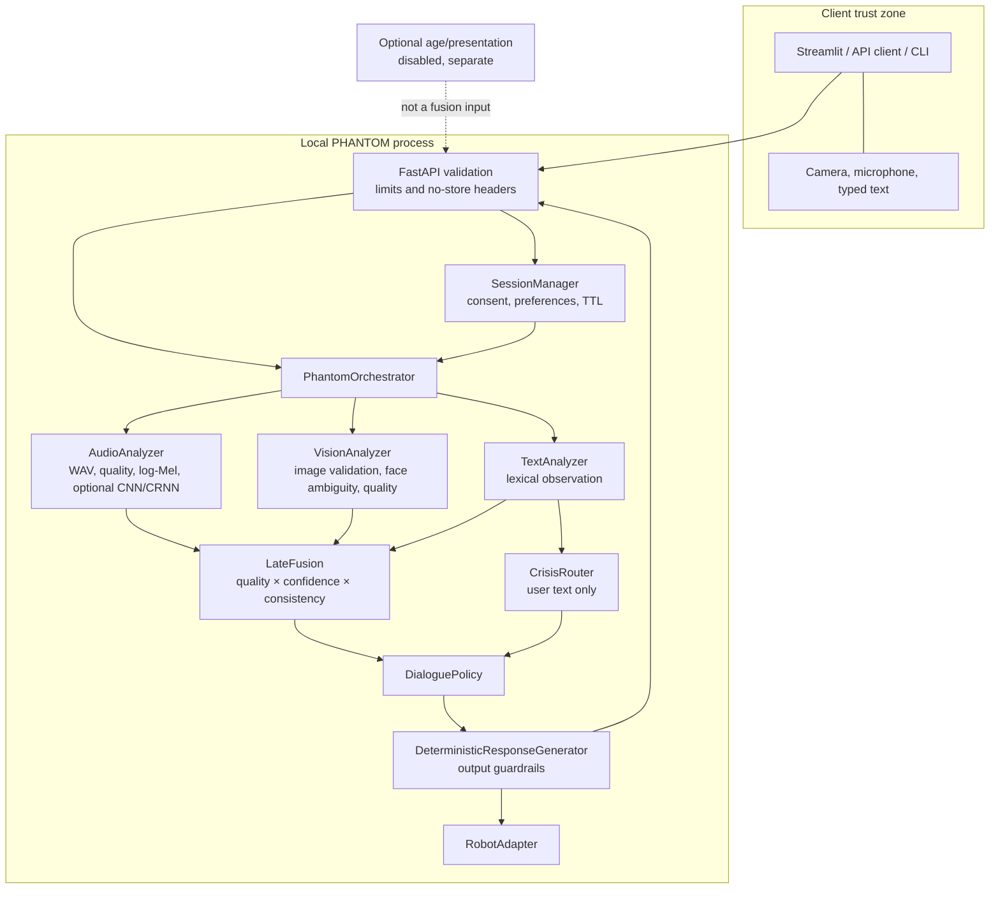
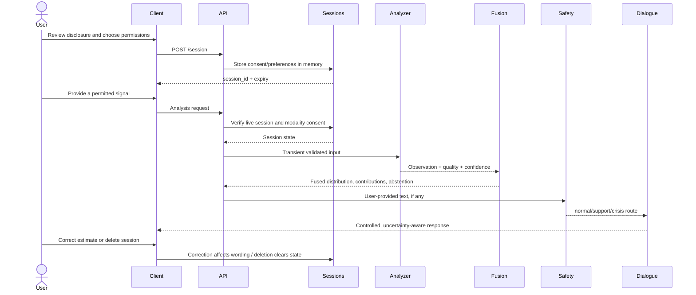
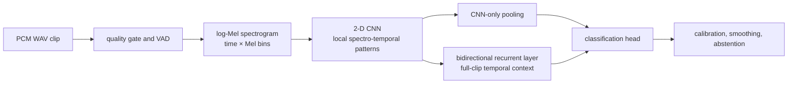

# Architecture

## Design goals

Project PHANTOM is split into replaceable observation, fusion, policy, and output layers. The design favors explicit consent, local processing, missing-modality operation, abstention, and inspectable decisions. It does not model emotion as an objective fact and does not make medical assessments.

## Component view



## Control flow



## Module responsibilities

| Layer | Responsibility | Does not do |
|---|---|---|
| Schemas | Strict Pydantic validation and explicit enums | Silently accept unknown fields |
| Session manager | Short-lived consent, preferences, privacy settings, last derived analysis | Persist raw media or share state across processes |
| Audio | Validate PCM WAV, preprocess, estimate quality/VAD, create log-Mel features, run the conservative baseline or an explicitly loaded CNN/CRNN checkpoint, calibrate/smooth | Treat transcript as acoustic evidence or enable random neural weights as a classifier |
| Vision | Validate JPEG/PNG, assess face count/quality, abstain on ambiguity, expose optional attributes separately | Identify people or persist embeddings |
| Text | Return a separate lexical observation | Diagnose or infer tone of voice |
| Fusion | Weighted late fusion using availability, quality, confidence, and temporal consistency | Use age/presentation or guarantee truth |
| Safety | Route explicit user language before ordinary dialogue | Act as a complete crisis detector or dispatch help |
| Dialogue | Decide whether to mention an observation, ask, slow down, offer an exercise with permission, or recommend human support | Give diagnosis, medication advice, or dependency-forming language |
| Robot | Translate approved response metadata into hardware-neutral commands | Control physical hardware in the bundled mock adapter |

## Optional spectrogram neural path



The CNN-only and convolutional recurrent (CRNN) options share the same log-Mel
front end and output-label contract. The CNN captures local time-frequency
patterns. The CRNN feeds the convolutional sequence into a bidirectional
recurrent layer, combining both architectures in one model. The CNN-only path
is retained as a lower-compute comparison; which option is more suitable is an
empirical question, not an architectural claim.

Bidirectionality uses earlier and later frames in a complete clip, so this path
is clip-level and non-causal. It must not be described as streaming inference.
Recurrent state is initialized for each clip and is not carried across users or
sessions. Variable-length batches must mask right-padding so padding does not
become evidence.

Training checkpoints record the maximum spectrogram-frame count used during
optimization. Training uses a reproducible seed-plus-sample crop so CNN/CRNN
comparisons do not depend on model-initialization RNG; validation, test, and
runtime inference use center crops. Runtime also clamps the configured safety
cap to the trained limit, preventing unexpectedly long recurrent sequences.

PyTorch remains an optional dependency. Neural modules and checkpoints are
loaded only when explicitly requested. Automatic device selection may use CUDA
when available and otherwise falls back to CPU; a forced CPU mode is available
for reproducibility and machines without a supported GPU. Checkpoints must be
loaded onto the selected device rather than assuming the device on which they
were created.

## Fusion baseline

For each usable modality `m`, the evidence weight is conceptually:

```text
weight_m = configured_weight_m × quality_m × confidence_m × temporal_consistency_m
```

Normalized weights become reported contributions. Distributions are averaged, then penalized for uncertainty and weak evidence. The implementation abstains when confidence is low, the top-label margin is small, or strong modalities disagree. This transparent rule is a baseline, not a learned or validated fusion model. A protocol exists for a future learned adapter.

## State and deletion

`SessionManager` keeps state in a process-local dictionary protected by a lock. Sessions have a configured TTL (30 minutes by default) and a capacity limit. Deletion or expiry clears the last analysis and derived-feature dictionary and removes the session entry.

Raw uploads exist transiently in the request/decoder path. FastAPI/Starlette upload handling may use framework-managed temporary storage for multipart files; deployment owners must verify OS/container cleanup and encrypted storage. Application-level deletion cannot erase independent client, proxy, browser, shell, crash-dump, or infrastructure copies.

## Trust boundaries

1. **Human to client:** consent must precede browser/OS sensor activation; server consent alone cannot light a hardware indicator.
2. **Client to API:** every field and upload is untrusted; enforce limits, media signatures, timeouts, and consent again.
3. **Decoder/model boundary:** malformed media and weights may exploit native libraries; isolate for any public deployment.
4. **Perception to dialogue:** observations are untrusted context, not instructions. A controlled policy outranks transcripts and model text.
5. **Service to robot:** only bounded, allowlisted commands may cross into physical hardware.
6. **Process to external services:** default is no cloud transfer. Adding a provider is a new privacy architecture requiring consent and review.

## Runtime profiles

- `default.yaml`: local mock-capable defaults.
- `development.yaml`: developer-oriented behavior; inspect before use.
- `privacy_strict.yaml`: strongest available local settings.

Configuration cannot enable cloud upload in this build. Environment variables are reserved for configuration/secrets; secrets must not enter YAML or Git.

## Extension contracts

Add a modality or model behind an interface and keep the schema stable. Any adapter must:

- be local-only by default and fail clearly when optional packages/weights are absent;
- disclose model/data provenance and checksum;
- emit quality, confidence, availability, and abstention;
- avoid global mutable state and expose a way to clear temporal state;
- never turn optional demographic output into emotion evidence;
- include synthetic unit tests and reproducible evaluation before stronger claims.

## Current maturity

Mock orchestration and policy behavior are runnable. Real audio preprocessing includes a conservative untrained baseline plus optional CNN/CRNN architecture and checkpoint-adapter scaffolding. No neural audio checkpoint or validated affect result is bundled. Real vision handling is experimental, and neither modality has validated affect performance. Optional attributes have no approved trained model. See [MODEL_CARD.md](../MODEL_CARD.md).
