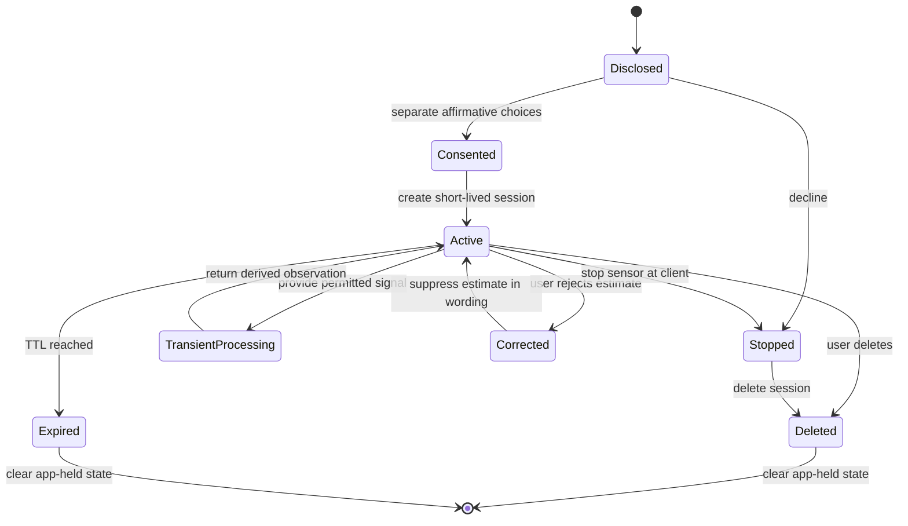

# Data governance

## Scope

This policy covers microphone audio, images/video, transcripts, affect observations, quality metrics, optional age-band or presentation estimates, session/preferences, model artifacts, experiment metadata, and logs handled by Project PHANTOM.

The default demonstrator is local-only and uses synthetic/mock audio and vision controls. Adding durable storage, cloud transfer, real research participants, or public access is a new processing purpose and requires a fresh review.

## Principles

1. **Purpose limitation:** collect only what is necessary for a disclosed, approved research question.
2. **Explicit choice:** sensor, text, optional attribute, storage, and any future cloud permission are separate.
3. **Data minimization:** prefer self-report, mock inputs, and aggregate metrics over raw biometric media.
4. **Ephemerality:** process in memory and delete quickly by default.
5. **Uncertainty and dignity:** observations never prove internal state or determine treatment of a person.
6. **No identity:** no face recognition, voice identity, tracking, or persistent embeddings.
7. **Accountability:** record source, license, consent provenance, purpose, owner, access, retention, and deletion for every artifact.

## Data inventory and defaults

| Data | Sensitivity | Default handling | Durable storage |
|---|---|---|---|
| Raw microphone audio | Biometric/personal, potentially sensitive | Transient request memory/decoder only | No |
| Raw image/video | Biometric/personal | Transient request memory/decoder only | No |
| Transcript/typed text | Personal; may reveal safety/health context | Analyze locally; do not log content | No |
| Face embeddings | Biometric identifier risk | Not created for persistence | Prohibited |
| Affect/quality distributions | Sensitive inference | Last analysis may exist in active session memory | No |
| Age/presentation estimate | Sensitive inference | Disabled, separate, uncertainty required | No |
| Consent/preferences | Personal/contextual | Active session memory | No |
| Session ID | Security capability | Active session memory; avoid logging value | No |
| Request metadata | Operational | Method, route, opaque request ID | Deployment-defined minimal retention |
| Research dataset/model | Licensed artifact | User-obtained, outside Git, access-controlled | Only after approval |

“No durable storage” describes the application design. Multipart frameworks, browsers, OSes, containers, reverse proxies, crash handlers, and observability tools may create independent copies. Deployment owners must audit and configure those layers.

## Lifecycle



Sensor stopping and server deletion are different actions: the UI must do both when the user ends a session.

## Consent record

A session records camera, microphone, text, optional age band, optional perceived presentation, raw-storage request, optional-attribute storage, cloud permission, and preferences. Defaults are false. This build rejects cloud upload. Optional analysis requires camera permission, and optional storage requires optional-analysis permission.

Consent must be:

- informed, specific, affirmative, revocable, and understandable;
- obtained before browser/OS sensor activation;
- renewed when purpose, model, destination, retention, or audience changes;
- independent of access to unrelated services;
- adapted for users who may be underage and the applicable guardian/assent rules.

Visual estimates are never a substitute for determining legal age or capacity. Self-report takes priority.

## Retention and deletion

Default session TTL is 1,800 seconds; schema bounds it to 60–86,400 seconds. Explicit deletion clears the last analysis and derived feature dictionary and removes the session. Expiry does the same when the session is accessed or pruned.

Deletion verification for a deployment must cover:

- application workers and replicated caches;
- temporary upload and decoder files;
- proxy/access/application logs;
- message queues, traces, crash dumps, swap, and backups;
- browser/service-worker storage and client downloads;
- research exports and model-training copies.

If any copy cannot be deleted immediately, disclose the schedule and legal/technical reason before collection. The current prototype makes no durable-copy guarantee outside its process.

## Research data intake

No data source is approved merely because it is public or downloadable. Before intake, complete a data card and verify the official source, version, license, media rights, commercial/redistribution restrictions, access agreement, data-subject provenance, population, minors, sensitive labels, withdrawal path, and automated-download permission.

The preparation script:

- does not download data;
- requires `--accept-license` as the operator's confirmation;
- requires an existing user-obtained directory;
- hashes files and writes a manifest;
- does not itself determine legal permission.

Example after approval:

```powershell
python scripts/prepare_data.py "Official dataset name" C:\approved\source --accept-license
```

Store raw/interim/processed data under the ignored `data/` zones or an approved encrypted volume. Never use a synced personal drive unless its data-processing terms, jurisdiction, access controls, retention, and organizational policy have been approved for that exact dataset.

## Access control

Assign least-privilege roles: data steward, researcher, evaluator, security reviewer, and release maintainer. Use unique accounts, strong authentication, encrypted devices/volumes, audit logs that omit content, and periodic access review. Remove access promptly. Never share datasets or weights through public issues, chat attachments, or repository history.

## Training and artifacts

Every experiment record must include dataset manifest hash, split manifest, consent/license decision, code commit, configuration, random seed, environment, preprocessing, label map, hardware, metrics, and known failures. Model cards must state whether outputs represent acted expression, annotator perception, or self-report.

Weights can memorize training data and inherit license restrictions. Treat them as sensitive supply-chain artifacts. Store them outside Git with hashes, access control, provenance, and deletion/rollback procedures.

## Optional visual attributes

Age-band and perceived-gender-presentation work requires separate necessity, proportionality, privacy, and human-rights review. It must be disabled by default, separately consented, uncertainty-aware, never stored without another explicit choice, and technically excluded from emotion fusion. It cannot be used for identity, biological sex/gender identity, eligibility, access, punishment, hiring, grading, insurance, law enforcement, or medical decisions.

Existing binary “gender” labels do not match the project construct. Until a valid construct and evidence exist, keep the implementation non-capable.

## Incidents and participant rights

Provide a clear channel to ask what is processed, correct preferences/estimates, withdraw, delete, and report harm. A real study needs participant information, withdrawal identifiers that do not expose identity, incident triage, breach notification analysis, and ethics approval where applicable.

Security incidents follow [SECURITY.md](../SECURITY.md). Never put personal or crisis-related details in a public ticket.

## Governance review checklist

- [ ] Named controller/owner, processor(s), purpose, legal basis, and jurisdiction
- [ ] Data-flow map includes client/framework/infrastructure copies
- [ ] Separate, comprehensible consent and stop/delete controls
- [ ] Approved data/model cards and immutable manifests
- [ ] Least privilege, encryption, retention, withdrawal, and incident process
- [ ] Bias, accessibility, underage, and prohibited-use review
- [ ] Local resources verified; no fabricated crisis contacts
- [ ] Tests demonstrate optional attributes cannot affect affect/dialogue
- [ ] Public claims match actual evidence
