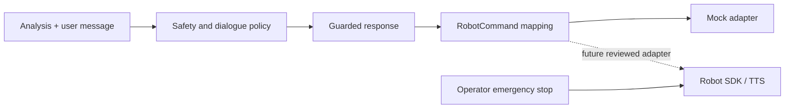

# Robot integration

## Status

The repository ships a hardware-independent protocol, a text-only speech-output fallback, and an in-memory mock adapter. It does not control a physical robot. The mock records commands for tests and is not evidence of hardware safety.

## Command contract

`RobotCommand` contains:

- `text`: already-approved response text;
- `speech_speed`: 0.5–2.0;
- `pause_seconds`: non-negative pause metadata;
- `gesture`: optional symbolic gesture token;
- `kiosk_mode`: optional presentation mode.

`RobotAdapter` requires `deliver(command)` and `stop()`. `MockRobotAdapter` validates non-empty text/speed and appends commands in memory. Calling `stop()` sets a test-visible flag; a subsequent mock `deliver()` clears that flag. It is **not a latched physical emergency stop**.

`TextOnlySpeechOutput` stores the last approved text and avoids a TTS dependency.

## Data flow



Only controlled response output crosses into the adapter. Never send raw transcript instructions, model tokens, face/voice data, age/presentation estimates, session IDs, or crisis metadata to gestures or speech.

## Minimal mock example

```python
from phantom.robot.base import RobotCommand
from phantom.robot.mock_robot import MockRobotAdapter

robot = MockRobotAdapter()
robot.deliver(
    RobotCommand(
        text="Would you like to tell me more?",
        speech_speed=0.9,
        pause_seconds=0.5,
        gesture=None,
        kiosk_mode=False,
    )
)
assert robot.last_command is not None
robot.stop()
```

## Hardware adapter requirements

Create a separate package/module for each vendor. Before connection:

1. Map only allowlisted symbolic gestures to bounded vendor motions.
2. Clamp speech speed, volume, motor speed, range, force, and duration in the hardware adapter—not just upstream.
3. Implement a latched, independent emergency stop and watchdog that fail safe on network/process loss.
4. Keep a human operator in line of sight and provide a physical power/motion cutoff.
5. Test in simulation, then an empty controlled area, before human proximity.
6. Prevent arbitrary code, SSML, URLs, or transcript commands from reaching the SDK.
7. Avoid gestures based on inferred emotion, age, or presentation stereotypes.
8. Suppress private/crisis content in public kiosk speech; offer a private text path.
9. Keep robot cameras/microphones off until the same explicit consent flow is complete.
10. Document firmware/SDK version, network endpoints, authentication, telemetry, and retention.

## Kiosk mode

Kiosk mode increases privacy and coercion risks. It must:

- display a persistent experimental/non-medical disclosure;
- show clear sensor-active indicators and a physical/onscreen stop;
- use headphones/private display for sensitive content;
- clear sessions automatically between users;
- prevent browser history/autofill/download retention;
- avoid requiring affect analysis for access to another service;
- be accessible from a seated position and via keyboard/screen reader;
- have a nearby operator and incident procedure.

## TTS considerations

Prefer offline TTS with documented model/data licenses. Disclose synthesized speech, validate pronunciation of support resources, cap volume, and provide simultaneous text/captions. Do not imitate a real person. A cloud TTS provider introduces a new transfer of sensitive text and is prohibited without explicit consent, contractual/privacy review, and a local fallback.

## Crisis route

In crisis mode, use short neutral text and no dramatic, celebratory, intimate, or attention-attracting gesture. Do not announce private content publicly. The robot cannot monitor, restrain, contact authorities, or guarantee help. Provide operator-configured local support options and allow immediate human takeover.

## Verification

- command validation and empty-text rejection;
- speed/volume/motion bounds at the final adapter;
- injection and unsupported gesture rejection;
- stop/watchdog behavior under process/network/power faults;
- session cleanup between users;
- no sensitive values in adapter logs;
- accessibility and public-privacy walkthrough;
- physical hazard assessment signed by the responsible operator.
