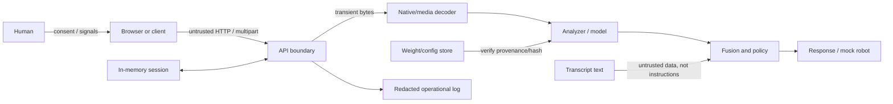

# Threat model

## Scope and assumptions

This model covers the local FastAPI/Streamlit/CLI prototype, transient media processing, session memory, optional future model weights, and mock robot output. It assumes the default service binds to loopback and has one trusted operator. Public, multitenant, cloud, or physical-robot deployment is outside the current security envelope.

Protected assets include sensor control, raw media/transcripts, session IDs, consent/preferences, derived inferences, logs, model weights/configuration, safety policy, and robot commands.

Potential actors include a malicious remote client if exposed, a local untrusted user, a compromised dependency/model, a curious operator, a malicious transcript/upload, and an accidental misconfiguration.

## Data-flow boundaries

## Threats and controls

| Threat | Impact | Current controls | Residual risk / required hardening |
|---|---|---|---|
| Unauthorized camera/microphone activation | Covert collection | Permissions default false; server consent required; UI controls | Browser/OS activation is client-controlled. Add explicit pre-activation UI, visible live indicator, hardware-permission reconciliation, and E2E tests |
| Consent bypass via direct API | Analysis without permission | Orchestrator rechecks modality consent | No identity/authentication. Add authenticated subject/session binding for any shared deployment |
| Session ID theft/guessing | Read/change state or analyze under another session | Cryptographic URL-safe IDs; validation; TTL | Bearer capability can leak. Add auth, avoid URL/log exposure, rate limits, rotation |
| Raw media or transcript leakage | Privacy harm | No application persistence; content not logged; no-store headers; local-only default | Multipart temp files, clients, proxies, crash dumps, swap, traces remain. Audit and isolate every layer |
| Biometric retention | Tracking or secondary use | No identity recognition; no persistent face embeddings; optional attributes disabled; in-memory TTL/deletion | Future adapters may create hidden caches/embeddings. Add data-flow inspection and artifact scans |
| Prompt injection in transcript | Dialogue/safety policy bypass | Deterministic policy treats transcript as data; response guardrails | Future LLM adapter raises risk. Use instruction hierarchy, structured fields, output allowlist, adversarial tests, no tool authority |
| Malicious media/polyglot | Decoder compromise or content smuggling | Byte limit, content-type/extension/signature validation, bounded read | Native decoder vulnerabilities remain. Decode in patched sandboxed worker with CPU/memory/time limits and no network |
| Decompression/resource bomb | Memory/CPU exhaustion | 10 MiB default and 30-second request timeout | Dimensions/duration and post-decode expansion need explicit ceilings; process timeout may not kill native work |
| Session flooding | Memory exhaustion | Maximum session count and expiry | No rate limit or per-principal quota. Add both plus bounded worker queue |
| Malformed metadata/path | Traversal or log injection | Filename reduced to basename; schemas constrain IDs; logs omit filenames/body | Audit all future file writes and normalize structured logs |
| Model-weight tampering | Arbitrary code or corrupted behavior | No downloaded weights in default path; local-files-only optional adapter | Add signed/checksummed manifest, safe tensor format, no remote code, read-only store, review/rollback |
| Dependency compromise | Code execution/data theft | Pinned major ranges, CI/security workflow, audit tooling | Ranges are not a lockfile/SBOM. Add hashes/lock, provenance, scheduled patching |
| Unsafe generated response | Diagnosis, manipulation, harmful advice | Controlled policy/templates, prohibited-output guardrails, safe fallback | Regex is incomplete; optional generator requires red teaming and a fail-closed boundary |
| Crisis false negative | False reassurance/delayed help | Explicit language router precedes dialogue; human-support message | Pattern matching is narrow and not multilingual/clinical. Disclose limitation, test broadly, provide easy human help access |
| Crisis false positive | Distress, loss of trust | Some context handling and support route | Quotation/negation/context remain difficult. Measure false escalation and use calm non-punitive wording |
| Optional attribute misuse | Discrimination/stereotyping | Separate schemas/consent; disabled; excluded from fusion | UI/operator may still misuse output. Keep non-capable until approved and prohibit high-impact contexts |
| Cross-session temporal leakage | One person's history affects another | Session state separated | Analyzer-level smoother instances may be shared across sessions; must audit/partition or clear temporal state before real deployment |
| Incomplete deletion | Data remains elsewhere | Session clear/removal and TTL | Application cannot delete client/infrastructure copies. Document boundaries and verify deployment retention |
| CORS/CSRF/public exposure | Unauthorized requests | Intended loopback binding | No deployment-grade auth/CSRF policy. Do not expose; configure explicit origins/tokens if redesigned |
| Physical robot command abuse | Injury/startle/privacy | Mock adapter only; bounded command schema | Real hardware needs allowlists, motion/volume limits, watchdog, emergency stop, operator |
| Misleading confidence | Automation bias/harmful decisions | Uncertainty wording and abstention | Uncalibrated score may still look authoritative. Calibrate, visualize carefully, test comprehension |

## Abuse cases

- An employer asks employees to “consent” to emotion monitoring.
- A school uses affect labels for grading or discipline.
- An operator enables camera access before the disclosure.
- A client uploads a huge image with a small compressed size.
- A transcript tells a future LLM to ignore safety policy or reveal other sessions.
- A malicious weight file executes deserialization code.
- An attacker creates sessions until capacity is exhausted.
- A user believes a cheerful label means another person is safe.
- A robot repeats crisis-related text loudly in a public setting.

These are release blockers, not merely documentation concerns.

## Security invariants to test

- No modality analysis without live matching consent.
- Optional visual attributes are disabled by default and never reach fusion weights.
- No raw bytes, transcript, session ID, secret, face crop, or optional attribute appears in logs.
- Invalid MIME/signature/extension, oversized, empty, no-face, multiple-face, and low-quality inputs fail or abstain safely.
- Unknown schema fields and cross-session analysis references are rejected.
- Crisis routing precedes ordinary coaching and cannot be triggered solely by affect output.
- User correction prevents subsequent emotion assertion.
- Session delete/expiry removes reachable application state.
- Mock robot stop prevents later delivery until deliberately reset, if the adapter supports that state.

## Deployment hardening backlog

1. Add authentication/authorization, strict CORS/CSRF design, rate limiting, per-user quotas, and audit-safe identifiers.
2. Isolate decoders/models in networkless workers with OS CPU/memory/process limits and post-decode dimension/duration ceilings.
3. Produce a locked dependency set, SBOM, signed builds, and signed/checksummed safe-format weight manifest.
4. Partition temporal state per session and securely clear worker buffers.
5. Verify browser sensor lifecycle, all temporary storage, logging/tracing, deletion, and backups.
6. Run independent penetration, privacy, prompt-injection, safety, and physical-robot reviews.

## Incident priorities

Treat covert sensor activation, raw biometric/transcript exposure, cross-session disclosure, remote code execution, bypassed crisis boundaries, and unsafe physical commands as critical. Disable the affected path, preserve minimal non-sensitive evidence, follow [SECURITY.md](../SECURITY.md), and do not use a public issue.
