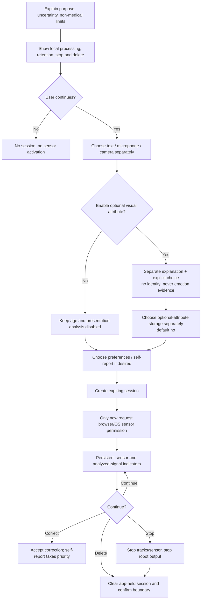

# User consent flow

## Objective

Consent is a continuing control, not a one-time checkbox. A person must understand what is active, what is analyzed, where processing occurs, what is retained, how to correct an estimate, and how to stop/delete—before a sensor activates.

## Required disclosure

Use plain language:

> Project PHANTOM is an experimental supportive interaction prototype. Voice, face, and text signals can be wrong and do not reveal your true feelings or mental health. This is not a medical assessment or emergency service. Processing is local in the default demo, raw media is not retained by the application, and you can stop and delete the session at any time.

Do not bundle this with terms of service or preselect optional permissions.

## Flow

## Consent choices

| Choice | Default | Required explanation |
|---|---|---|
| Text analysis | Off | Text is analyzed locally; may include sensitive context; safety language may change response route |
| Microphone/audio | Off | Acoustic features are not the transcript; raw audio is transient; hardware indicator shown |
| Camera/image | Off | Expression is uncertain; no identity recognition; no face embedding retained |
| Age band | Off | Broad visual estimate only; can be wrong; self-report wins; no eligibility use |
| Perceived presentation | Off | Appearance perception, not sex or identity; unknown supported; no stereotyping |
| Raw storage | Off | Core prototype does not implement durable raw-media storage; any future storage needs purpose/location/retention |
| Optional-attribute storage | Off | Separate from analysis consent and prohibited by default |
| Cloud upload | Unavailable | Default build rejects it |

## UI requirements

- A persistent header shows **MIC OFF/ON**, **CAMERA OFF/ON**, text analysis, age-band state, presentation state, storage state, and local/cloud destination.
- Sensor activation is a direct user gesture after consent; page load never activates a sensor.
- Start and stop are separate, keyboard-accessible buttons with text and color/icon—not color alone.
- Browser/OS permission denial does not trigger repeated prompts.
- The result says “available signals may indicate,” shows quality/contributions/uncertainty, and keeps optional attributes visually separate.
- “The estimate is incorrect” is as prominent as the result.
- “Delete session data” is always visible and confirms what the application deleted and what external copies it cannot control.
- Crisis resources do not hide stop/delete controls.
- Use readable contrast, visible focus, semantic labels, status announcements, captions/transcripts, and zoom-responsive layout.

## Server and sensor state

A server permission does not activate hardware. A browser stream can remain active even if a session expires. The client must listen for expiry/deletion/navigation and stop every media track. Conversely, stopping the track does not delete the server session; offer both actions.

On end-session:

1. stop microphone/camera tracks and recording callbacks;
2. clear client buffers, previews, object URLs, and form fields;
3. stop robot/TTS output;
4. call session deletion;
5. discard the session ID and analysis from UI state;
6. show a scoped confirmation.

## Corrections

When a user says an estimate is wrong:

- acknowledge without defensiveness;
- suppress the earlier emotion wording;
- treat their description/preference as primary;
- do not use the correction to train or store data without separate research consent;
- allow modality disablement and deletion.

## Potentially underage users

Never use visual age to establish capacity. Follow jurisdiction and study policy for guardian consent and user assent. Use minimal data, no romantic/sexual/dependency-forming interaction, no targeted persuasion, easy trusted-adult contact, and a clear operator escalation path.

## Consent test script

- Start with every permission off and inspect browser sensor indicators.
- Attempt each API analysis without consent; expect denial.
- Grant one modality and verify others remain denied.
- Enable optional analysis without camera; expect rejection.
- Stop sensor and verify OS indicator turns off.
- Correct an estimate and verify no further assertion.
- Delete and verify subsequent session access fails.
- Expire a session while a client is open; verify tracks stop and UI clears.
- Complete the flow with keyboard/screen reader and at 200% zoom.
